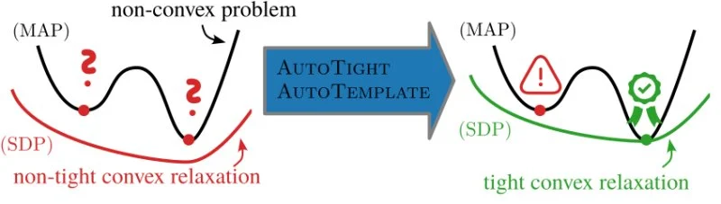

Welcome to POPR's documentation!
=================================

.. warning::

   This package is currently in pre-release state. You are welcome to try it out, 
   and please get in touch via github or e-mail if you have any questions, suggestions or issues. 

.. include:: ../../README.md
   :parser: myst_parser.sphinx_

.. toctree::
   :maxdepth: 2
   :hidden:

   self
   quickstart
   api
   examples
   whatsnew
   contributing

.. 
   currently commented out cause it does not seem useful:
   Indices
   -------
   * :ref:`genindex` 
